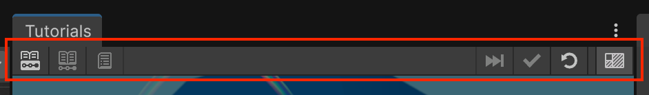

# Authoring Toolbar

The Authoring Toolbar appears at the top of the **Tutorials** window when the Tutorial Authoring Tools package is installed, and it's designed to help with the creation and editing of IETs.

The Authoring Toolbar allows you to select the current Tutorial Container, Tutorial, or Tutorial Page, and to skip or auto-complete instructions that otherwise would require user action.

To access the Authoring Toolbar, from the main menu select **Tutorials** > **Show Tutorials Window**. This opens the **Tutorials** window, with the Authoring Toolbar at the top of the window:

The function of each button is as follows:

| Button | Description |
| :---- | :---- |
| **Select Container** | Opens the current Tutorial Container in the **Inspector** window, allowing you to edit the container. |
| **Select Tutorial** | Opens the current Tutorial in the **Inspector** window, allowing you to edit the tutorial. |
| **Select Page** | Opens the current Tutorial Page in the **Inspector** window, allowing you to edit the page. |
| **Skip to End** | Goes to the final Tutorial Page in the current tutorial. |
| **Autocomplete Page** | Goes to the next Tutorial Page in the current tutorial and skips any required tasks. |
| **Run Startup Code** | Opens the Welcome Dialog window as if the whole project had been opened for the first time. |
| **Preview Masking** | Shows/hides the currently applied Editor mask. Allows to remove masking at any point in order to edit tutorial assets when the **Inspector** would otherwise be blocked out. |
