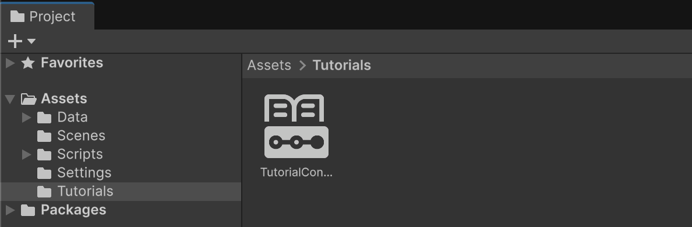
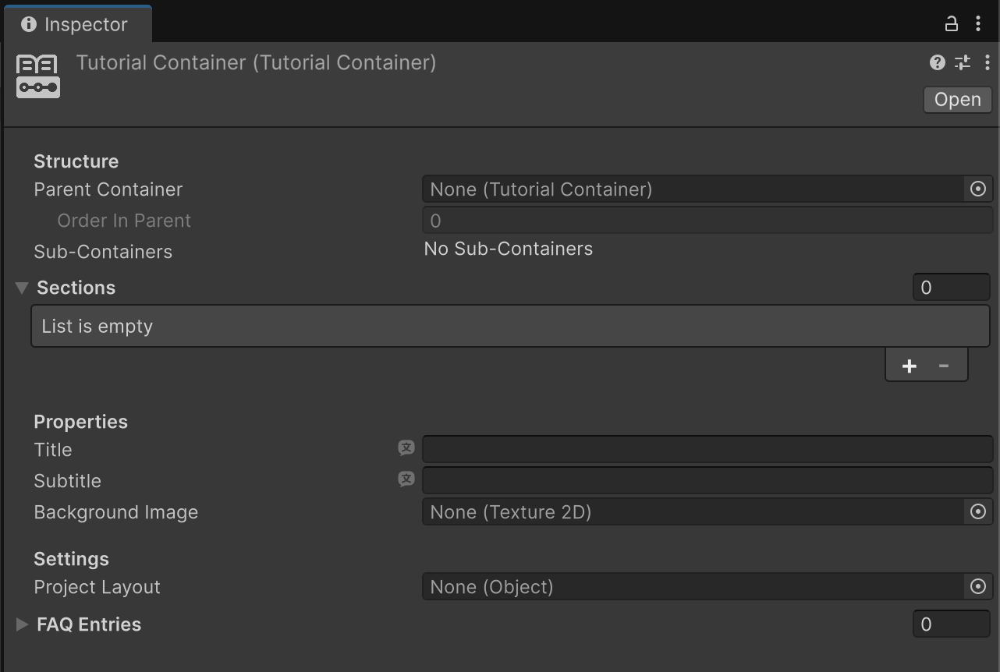
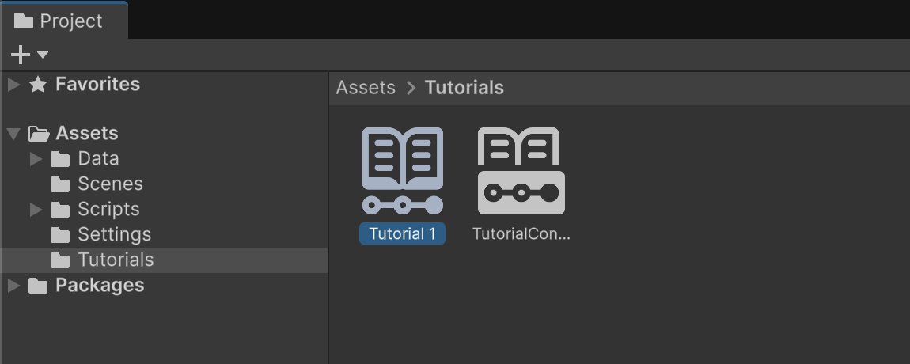
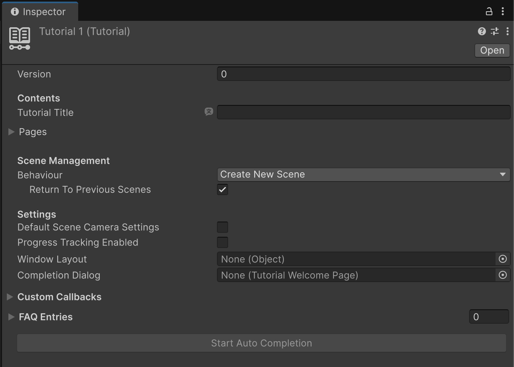
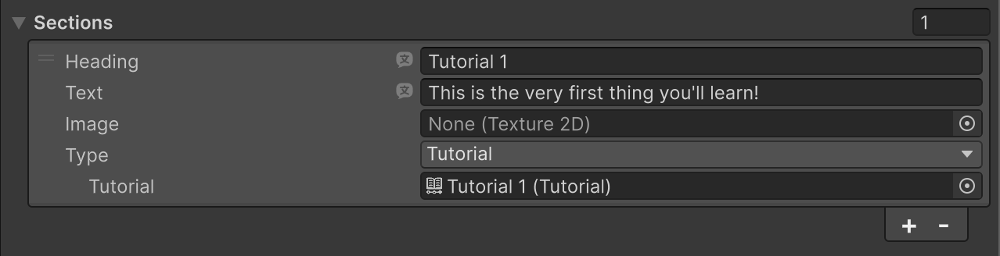
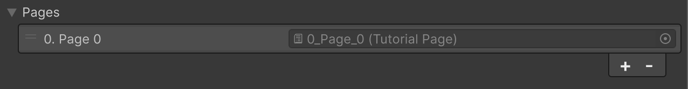
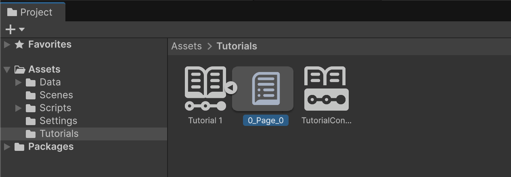
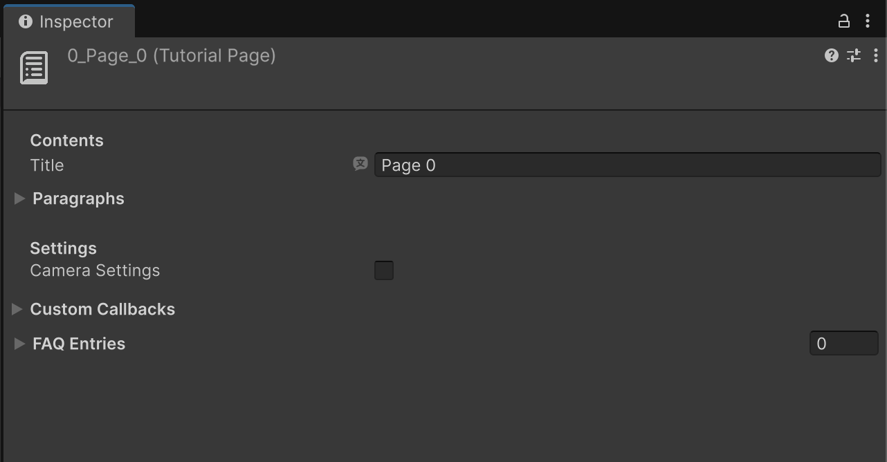
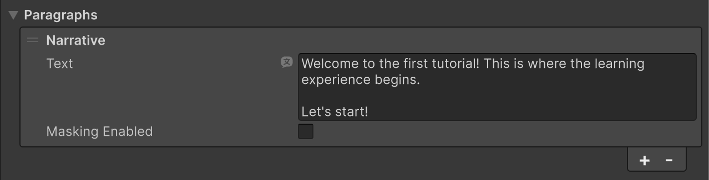
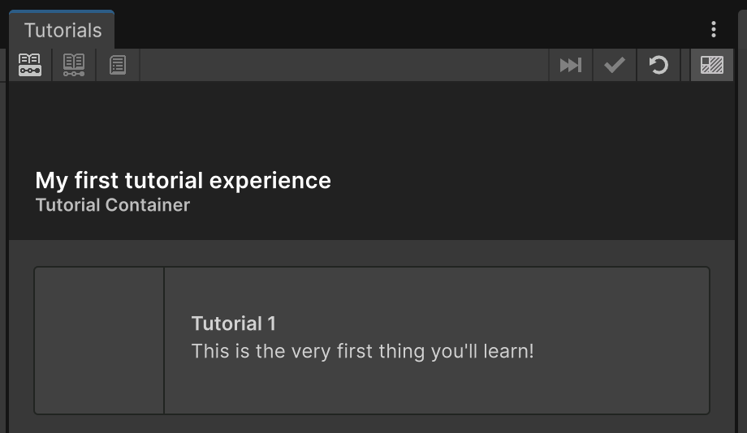

# Creating Tutorials

This page will get you started with creating a tutorial from scratch.

## Project setup

1. First, ensure you have installed the [Tutorial Framework](https://docs.unity3d.com/Packages/com.unity.learn.iet-framework@latest) and Tutorial Authoring Tools packages.

2. In the **Project** window, right-click the **Assets** folder and select **Create** > **Folder**, then rename the new folder "Tutorials".

The Tutorial Framework package provides three key assets to allow you to create and structure your IETs:

* [Tutorial Containers](https://docs.unity3d.com/Packages/com.unity.learn.iet-framework@latest/manual/tutorial-containers.html)
* [Tutorials](https://docs.unity3d.com/Packages/com.unity.learn.iet-framework@latest/manual/tutorials.html)
* [Tutorial Pages](https://docs.unity3d.com/Packages/com.unity.learn.iet-framework@latest/manual/tutorial-pages.html)

These assets are hierarchical: Containers are the first thing the user sees when they open the **Tutorials** window, and can act as macro-units of the learning process. Containers contain Tutorials, and Tutorials are composed of Pages.

Let's begin by creating a Container as the top-level element in the IET.

## Tutorial Containers

Tutorial Containers are the first tier users see in the **Tutorials** window and represent top-level content.

To create and configure a Tutorial Container asset, follow these instructions:

1. In the **Project** window, right-click in the **Tutorials** folder and select **Create** > **Tutorials** > **Tutorial Container**.

A new Tutorial Container asset will appear:

Select it to inspect its properties:

Feel free to start adding a Title and Subtitle, and optionally a Background Image.

> [!NOTE]
> When you inspect the Container, you'll notice that the **Parent Container** property in the **Inspector** window is set to None. While Containers can be nested into each other to create complex tutorial hierarchies, in this case we want to leave it to **None** to identify this Container as a starting point of our IET.

## Tutorials

Tutorial assets are the building blocks of your learning experiences. You'll use Tutorial assets in conjunction with Tutorial Container assets to enable users to access the information you want to give to them, in the order you want them to see it.

To create and configure a Tutorial asset, follow these instructions:

1. In the **Tutorials** folder, right-click and select **Create** > **Tutorials** > **Tutorial**, then rename the new tutorial "Tutorial 1".

Select the Tutorial to inspect its properties:

In order to make a Tutorial visible to the user, you need to add it to a Tutorial Container.

2. In the **Tutorials** folder, select the **Tutorial Container** asset that you created previously.
3. In the **Inspector** window, under the **Sections** section, select the **Add** (**+**) button to add a new section.
4. Ensure the **Type** property is set to **Tutorial**.
5. Select the **Tutorial** property picker (**⊙**) and select **Tutorial 1**.

The "Tutorial 1" tutorial is now linked to the Container and is displayed in the **Tutorials** window. However, it still doesn't contain any pages, so let's create some now.

## Tutorial Pages

Tutorial Page assets represent the individual steps of a Tutorial. Users engage with pages as they progress through the learning experience.

Pages are sub-assets contained inside Tutorial assets. This means that a page can't be moved from Tutorial to Tutorial, rather, it belongs to it.

To create and configure a Tutorial Page asset, follow these instructions:

1. In the **Tutorials** folder, select the **Tutorial 1** asset.
2. In the **Inspector** window, under the **Pages** section, select the **Add** (**+**) button to add a Page.

3. In the **Project** window, in the **Tutorials** folder, use the foldout (triangle) to expand the **Tutorial 1** asset and select the **0_Page_0** asset.

Now you can customize the Page's properties, including its title:

Notice that as you edit a Page's title, its ScriptableObject gets renamed too.

4. In the **Inspector** window, under the **Paragraphs** section, select the **Add** (**+**) button to add a Narrative paragraph, then add some text to it.

There are five different [paragraph types](https://docs.unity3d.com/Packages/com.unity.learn.iet-framework@latest/manual/tutorial-pages.html#paragraphs) to choose from. Feel free to add paragraphs of different types at this point, to get a feeling for the available options.

## Testing the tutorial

Once at least a Container, a Tutorial and a Page have been created, you can try this tutorial by opening the **Tutorials** window from **Tutorials** > **Show Tutorials Window**.

If everything has been set up correctly, you should see a box in the Tutorials window that represents the Tutorial Container that you have just created, and you should be able to step through the Tutorial by clicking on it:

## Next steps

This quickstart page illustrates how to get acquainted with the data format that powers IETs. You can read more about these in the specific sections of the documentation for [Tutorial Containers](https://docs.unity3d.com/Packages/com.unity.learn.iet-framework@latest/manual/tutorial-containers.html), [Tutorials](https://docs.unity3d.com/Packages/com.unity.learn.iet-framework@latest/manual/tutorials.html) and [Tutorial Pages](https://docs.unity3d.com/Packages/com.unity.learn.iet-framework@latest/manual/tutorial-pages.html).

Alongside those, the Tutorial Framework package has a selection of other asset types that allow to configure how the IET looks and plays out, like the ability to add a [Tutorial Welcome Page](https://docs.unity3d.com/Packages/com.unity.learn.iet-framework@latest/manual/tutorial-welcome-page.html), or customize [Project Settings](https://docs.unity3d.com/Packages/com.unity.learn.iet-framework@latest/manual/tutorial-project-settings.html) or [Styles](https://docs.unity3d.com/Packages/com.unity.learn.iet-framework@latest/manual/tutorial-styles.html).
