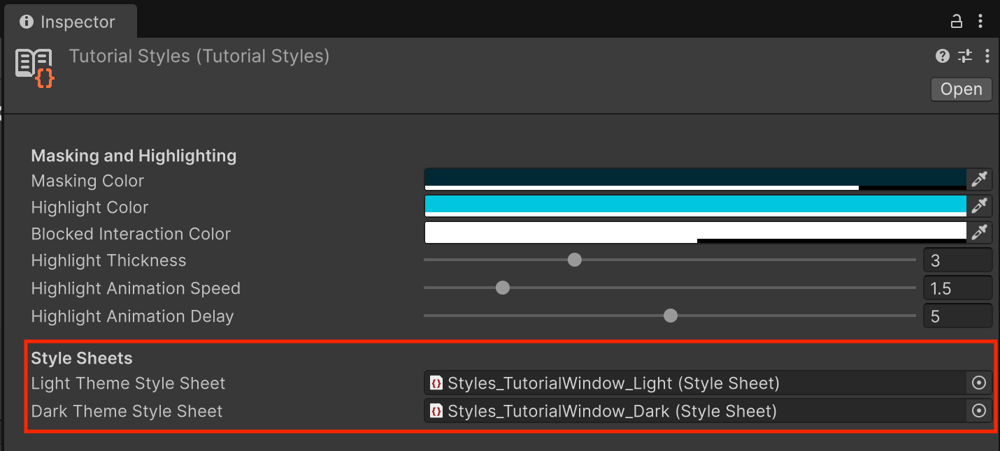
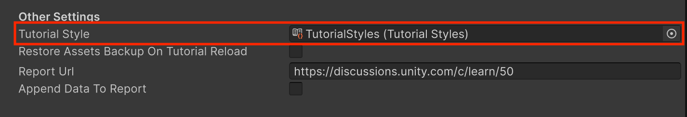

# Customizing Tutorial Styles

The Tutorial Framework ships with default visual styles, but you can override them with your own Style Sheets to make the look of your tutorials match the rest of your project.

1. In the **Project** window, right-click and select **Create** > **Tutorials** > **Tutorial Styles** (if you don't already have one in the project).
2. In the **Project** window, right-click and select **Create** > **Tutorials** > **Dark Tutorial Style Sheet**.
3. In the **Project** window, right-click and select **Create** > **Tutorials** > **Light Tutorial Style Sheet**.
4. Select the new Tutorial Styles asset. In the **Inspector** window, under the **Style Sheets** section, use the **Style Sheet** picker (**⊙**) to select the new Light and Dark Style Sheets.

5. Select the Tutorial Project Settings asset, and, in the **Inspector** window, under the **Other** section, use the **Tutorial Styles** picker (**⊙**) to select the newly-created **Tutorial Styles** asset.

6. Reopen the **Tutorials** window to see the styles applied.