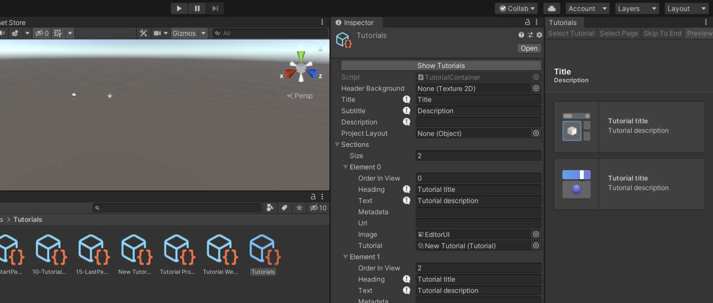

# About Tutorial Authoring Tools

Use the Tutorial Authoring tools to author In-Editor Tutorials. Currently, this package provides only UI functionality and no public APIs, with the exception of `CommonTutorialCallbacks`.

The Tutorial Authoring Tools should be used while developing tutorials, but the final published tutorial projects should not include the Tutorial Authoring tools.

## Preview package
This package is available as a preview package. It is not recommended for use in production. The features and documentation of this package are subject to major changes until its official release.

## Installation

This package is not currently discoverable. To install this package, add the following line to `Packages/manifest.json`:  
`"com.unity.learn.iet-framework.authoring": "1.0.0-pre.5"`

Make sure the framework and the authoring tools have compatible versions, which are most likely the latest versions of each package.

## Requirements

This version of Tutorial Authoring Tools is compatible with the following versions of the Unity Editor:

* 2019.4 and later (LTS versions recommended)
