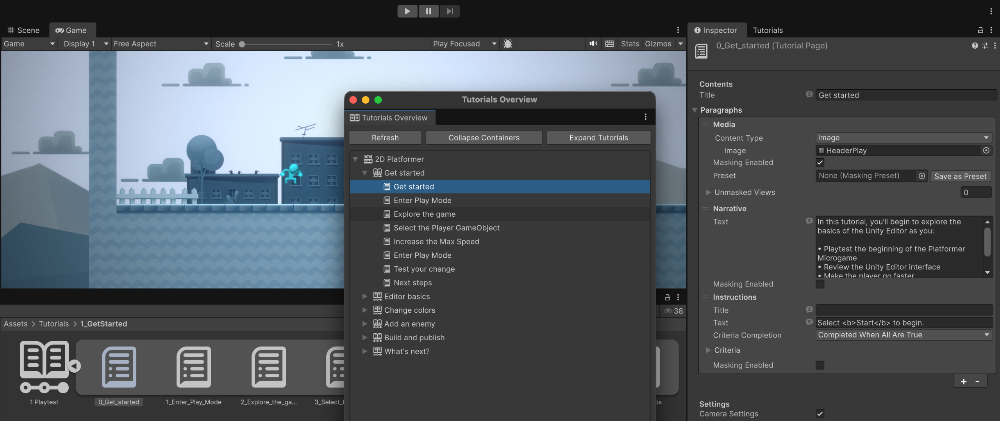

# About Tutorial Authoring Tools

The Tutorial Authoring Tools package contains the authoring tools you need to create and edit IETs. You use this package while you author your IETs, and then remove it from the project before final delivery.

For the user to experience IETs, they need to have the [Tutorial Framework](https://docs.unity3d.com/Packages/com.unity.learn.iet-framework@latest) package installed.

## Installation
1. From the main menu of the Unity Editor, select **Window** > **Package Management** > **Package Manager**.
2. From the [navigation panel](https://docs.unity3d.com/Manual/upm-ui-nav.html), select **Unity Registry**.
3. Search for “Tutorial Authoring Tools”, then click **Install**.

**Note:** This will also install the Tutorial Framework package as a dependency.

Make sure the framework and the authoring tools have compatible versions, which are most likely the latest versions of each package.

## Requirements

This version of Tutorial Authoring Tools is compatible with the following versions of the Unity Editor:

* Unity 6.5 and newer

## Dependencies

Tutorial Authoring Tools 2.0.5 depends on the following packages:

* Tutorial Framework `com.unity.learn.iet-framework` 6.0.5
