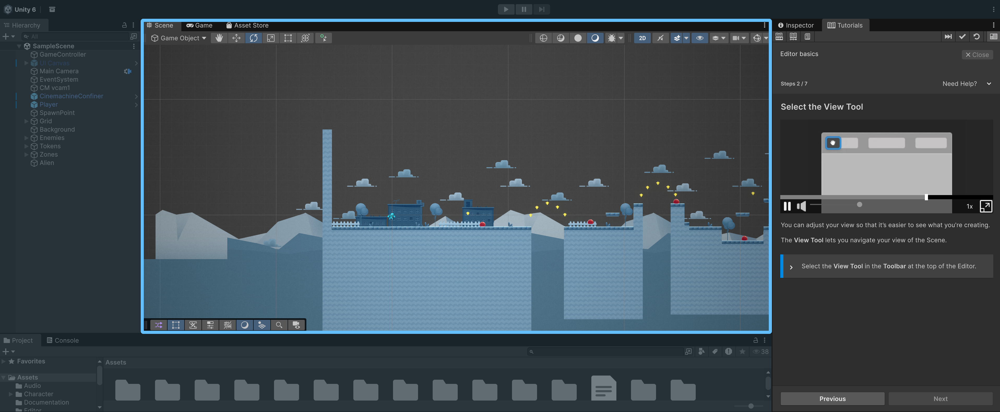

# Masking and Highlighting

You can mask and unmask any part of the Unity Editor to prevent unnecessary interactions. Masking is a good way to teach users where certain actions take place, by darkening everything else and optionally blocking interaction with it.

Where to find masking:

1. In a [Tutorial Page](https://docs.unity3d.com/Packages/com.unity.learn.iet-framework@latest/manual/tutorial-pages.html) asset, under the **Paragraphs** section, select the **Add** (**+**) button, then select the paragraph type you want to create.
2. For the **Instructions**, **Media**, and **Narrative** paragraph types, there's an **Enable Masking** checkbox. Enable it to reveal the masking settings.
3. Use the foldout (triangle) to expand the **Unmasked Views** section, then select the **Add** (**+**) button to add an **Unmasked View**. Each entry in this list defines a part of the Editor that will remain visible (unmasked) while the page is shown.

## Mask Presets

The Tutorial Framework package offers Masking Presets to be able to create preset masks that can be reused across different Tutorials. Find out more in the Reference for [MaskingPreset](https://docs.unity3d.com/Packages/com.unity.learn.iet-framework@latest/manual/masking-presets.html).

## Mask Properties

Here are all the properties that masking exposes, to allow you to customise exactly what the mask should include.

### Selector Type

The **Selector Type** dropdown defines what kind of UI you want to unmask:

- **Editor Window**: select one of the Editor's tabbed windows (Scene view, Inspector, Project browser, etc.). **This is the option you want most of the time.**
    - **Editor Window Type**: the type of the window you want to highlight (e.g. **SceneView**, **InspectorWindow**).
    - **Alternate Editor Window Type**: usually left empty. Lets you list fallback type names so the same tutorial keeps working across Unity versions where a window type was renamed.
- **GUI View**: select a part of the Editor that isn't a tabbed window, like the top toolbar or the application status bar.
    - **View Type**: the view you want to highlight (toolbar, app status bar, etc.).

### Mask Type

The **Mask Type** property controls how the unmasked area behaves:

- **Fully Unmasked**: the user can see and interact freely with this view.
- **Block Interactions**: the view is highlighted and visible, but the user can't interact with it. Useful to point out something without letting the user change it.

You can unmask multiple windows by adding more entries to the **Unmasked Views** list.

### Mask Size Modifier

The **Mask Size Modifier** property defines whether the mask extends to the whole window or stays unmodified. In most cases you want to keep this set to **No Modifications**.

### Unmasked Controls

By default, the whole of the selected GUI View or Editor Window is unmasked. To highlight only one specific control inside it, add entries to the **Unmasked Controls** list.

Each entry has two key settings:

- **Selector Match Type**: when multiple controls match the criteria, choose whether to pick the **First**, the **Last**, or **All** of them.
- **Selector Mode**: the method used to find the control.

#### Visual Element (recommended)

For UI Toolkit-based interfaces (most of the modern Editor), use the **Visual Element** mode. It selects a control by any combination of:

- **Visual Element Name**: the name of the element itself.
- **Visual Element Class Name**: a USS class applied to the element.
- **Visual Element Type Name**: the fully qualified C# type name of the element (Label, Button, etc.).

The easiest way to fill these in is the **Pick Visual Element** button: click it, then click the element you want to highlight in the Editor. The settings are filled with the picked element's values. **Make sure the corresponding Editor Window is set as the selected view first** — the picker doesn't set it for you.

#### Other selector modes (IMGUI)

For legacy IMGUI controls that aren't VisualElements (often shown as **IMGUIContainer** in the UI Toolkit Debugger), use one of: **Gui Content**, **Named Control**, **Property**, **Gui Style Name**, or **Object Reference** (the last one is the way to highlight an asset in the Project Browser or an object in the Scene Hierarchy).

#### Finding the right selector

When picking doesn't work or you need to inspect the UI hierarchy, the Editor offers two debuggers that expose the values you'd plug into the Selector Mode settings.

## Debugging Masks

### UI Toolkit Debugger

Open it from **Window > UI Toolkit > Debugger**, then pick the panel that contains the control from the top-left dropdown. The hierarchy lists every VisualElement in that panel; hovering an entry highlights the matching element in the Editor.

For each element, the debugger shows three pieces of information you can use in the Selector settings:

- The **white** name is the **Visual Element Type Name** (e.g. `EditorToolbarToggle`).
- The **blue** name prefixed with `#` is the **Visual Element Name** (e.g. `#Play`).
- The **yellow** names prefixed with `.` are the **Visual Element Class Names**.

Usually filling in the type name and the name is enough.

If the element you're trying to highlight shows up as **IMGUIContainer**, it's a legacy IMGUI control and won't be visible as an individual VisualElement — use the IMGUI Debugger instead.

### IMGUI Debugger

Open it from **Window > Analysis > IMGUI Debugger**. Pick the window to inspect from the top-left dropdown; the central view lists every draw call, and clicking an entry highlights the corresponding area in the Editor.

Two pieces of information are useful for selectors:

- The **GUIContent** and **Style** shown on each draw call line can be plugged into the **Gui Content** or **Gui Style Name** Selector Modes.
- Switching the Inspected View dropdown to **Named Controls** lists every control registered with `GUI.SetNextControlName`, ready to be used with the **Named Control** Selector Mode.
