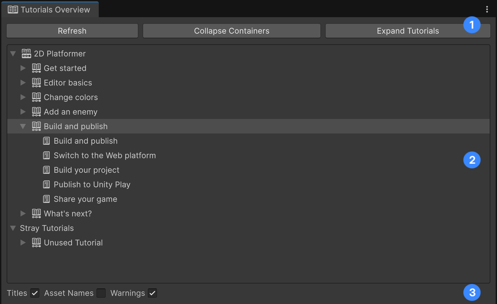
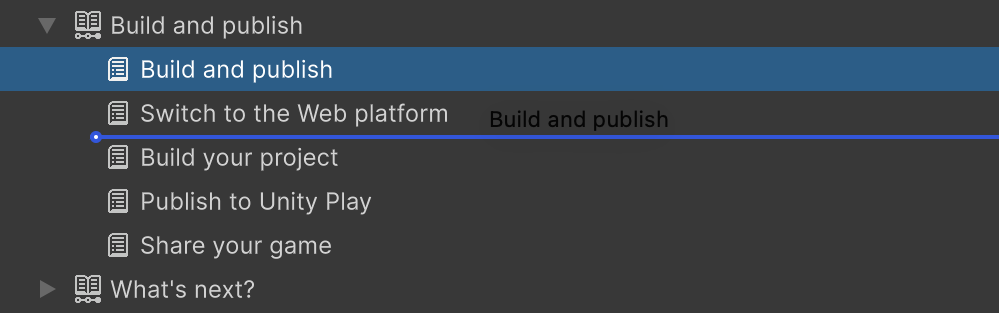

# Tutorials Overview Window

The Tutorials Overview window is a tool to get an overview of all Tutorial Containers, Tutorials and Tutorial Pages in the project, and how are they structured in relation to each other.

You can open it by going to the top menu and selecting **Tutorials > Authoring > Tutorials Overview**.

The window is made up of three main parts:

1. The top bar houses buttons to control the Tree View.
    - **Refresh**: Click this button to refresh the view and sync it with the data in the project. This can be useful when a new Tutorial or Tutorial Container has just been created or deleted.
    - **Collapse/Expand Containers**: This button expands or collapses all Tutorial Container elements in the Tree View.
    - **Collapse/Expand Tutorials**: This button expands or collapses all Tutorial elements in the Tree View. Note: the effect of the button might not be visible if all Containers are currently collapsed.
2. The central panel is the Tree View that visualizes the current structure of all tutorials in the project.
3. The bottom bar features controls to decide what to visualize in the Tree View:
    - **Titles**: Displays the Title property of each asset.
    - **Asset Names**: Displays the filename of the asset.
    - **Warnings**: Displays/hides special warnings, such as when the same Tutorial is referenced within two distinct Tutorial Containers.

## Reorganizing Tutorial Containers and Tutorials

It is possible to use the Tree View in the central panel not only to browse tutorial content, but also to reorganise it quickly. You can:
- Drag a Tutorial Container into another Container to parent it.
- Drag a Tutorial Container to an empty space to make it a root Container.
- Drag Tutorials across Containers to re-assign them to that Container.
- Drag a Tutorial onto their same Container to reorder it.

**Note:** You can't move Pages between different Tutorials.

## Stray Tutorials

At the bottom of the Tree View, the section named **Stray Tutorials** contains all Tutorial assets that haven't been referenced in any Container. That is, they are not visible to the users.

**Note:** The section only appears if there is at least one Tutorial that respects this condition.